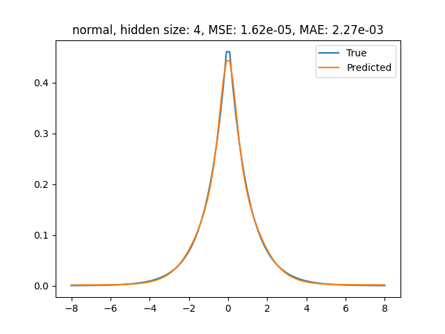
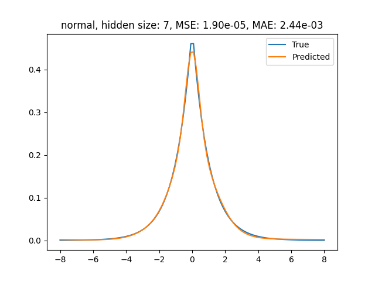
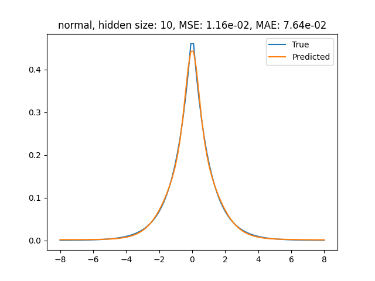
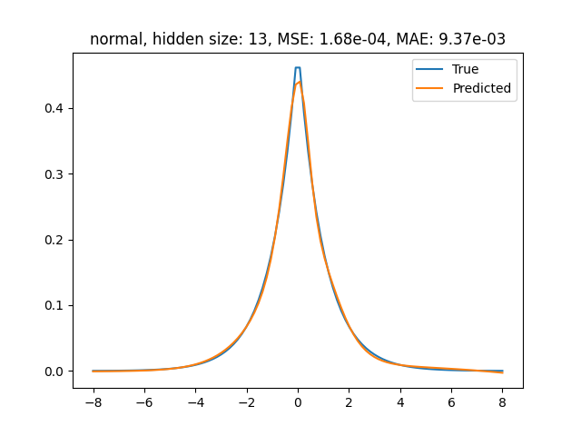
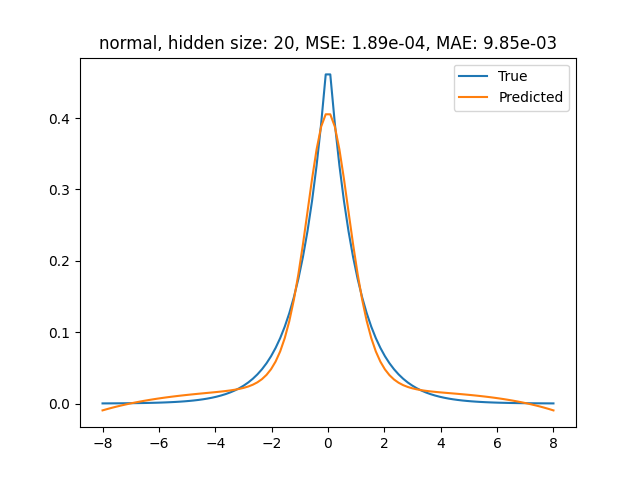

# WSI LAB 5 - sztuczna sieć neuronowa

Zespół:
- Monika Jung
- Tomasz Kurzela

Prowadzący:
- Katarzyna Nałęcz-Charkiewicz

# Zadanie

Cel zadania polega na implementacji perceptronu dwuwarstwowego oraz nauczeniu go reprezentowania zadanej funkcji f(x), opisującej rozkład Laplace'a. Funkcja ta jest dana wzorem:

$$
f(x) = \frac{1}{2b}e^{-\frac{|x-\mu|}{b}}
$$

Zakres x: [-8, 8]
Wartości $\mu$ i b: $\mu$ = 0, b = 1

Zatem funkcja to: $f(x) = \frac{1}{2} e^{-|x|}$

Zadanie realizowane jest w zespołach dwuosobowych.

## Kroki do wykonania

1. Zaimplementuj perceptron dwuwarstwowy, który będzie reprezentował funkcję f(x) dla zadanego zakresu x oraz wartości  $\mu$ i b.
2. Zbadaj jakość aproksymacji, obliczając Mean Squared Error (MSE) oraz Mean Absolute Error (MAE) między wartościami rzeczywistymi funkcji a wartościami przewidywanymi przez sieć.
3. Przedstaw wykres funkcji rzeczywistej oraz funkcji przewidywanej przez sieć.
4. Zbadaj, jak liczba neuronów w warstwie ukrytej wpływa na jakość aproksymacji, zmieniając jej wartość i porównując wyniki.

## Wskazówki

- Użyj funkcji aktywacji sigmoidalnej w warstwie ukrytej i metody gradientowej do znajdowania wag sieci.
- Zadbaj o odpowiedni dobór współczynnika uczenia oraz liczby iteracji uczenia.

## Architektura sieci

Model został zaimplementowany w języku Python przy użyciu biblioteki `numpy`. Sieć składa się z:

1. **Warstwa wejściowa** – przyjmuje jedną wartość wejściową \( x \),
2. **Warstwa ukryta** – zawiera `hidden_size` neuronów, każdy z aktywacją sigmoidalną,
3. **Warstwa wyjściowa** – składa się z jednego neuronu (regresja), bez funkcji aktywacji.

Uczenie odbywa się za pomocą **propagacji wstecznej (backpropagation)** i **gradient descent**, z funkcją błędu **MSE (Mean Squared Error)**.

## Implementacja

- Wagi pierwszej warstwy inicjalizowane są losowo z przedziału [-1/sqrt(n), 1/sqrt(n)],
- Wagi drugiej warstwy początkowo ustawiono na zero,
- Dla stabilności uczenia zastosowano **normalizację danych wejściowych i wyjściowych** (średnia = 0, odchylenie standardowe = 1),
- Funkcja aktywacji `sigmoid` oraz jej pochodna zostały zaimplementowane ręcznie,
- Zaimplementowano metodę `train()`, która wykonuje propagację w przód i wstecz przez określoną liczbę epok.

## Parametry

- liczba próbek = 100
- rozmiary warstwy ukrytej: [4, 7, 10, 13, 20]
- learning rate = 0.01
- liczba epok: 50'000 - przy większych liczbach zasoby komputera były niewystarczające i liczenie zajmowało bardzo długo
- liczba powtórzeń trenowania i predykcji: 5
- testowane dla wariantu z normalizacją, dalej wariant bez normalizacji

## Testy i wyniki

Dla każdego wybranego rozmiaru perceptron był testowany 5 razy, aby zminimalizować udział losowości przy przy tworzeniu sieci na początku.

Wyniki błędów ze wszystkich prób:

mean square error
| size | min | max |
| -- | ------- | -------- |
|  4 | 1.60e-05 | 1.69e-03 |
|  7 | 1.84e-05 | 2.26e-04 |
| 10 | 1.71e-05 | 1.16e-02 |
| 13 | 7.74e-05 | 1.41e-04 |
| 20 | 1.76e-04 | 2.01e-04 |

mean absolute error
| size | min | max |
| -- | ------- | -------- |
|  4 | 2.26e-03 | 4.04e-02 |
|  7 | 2.72e-03 | 1.09e-02 |
| 10 | 2.27e-03 | 7.64e-02 |
| 13 | 5.91e-03 | 8.04e-03 |
| 20 | 9.52e-03 | 1.02e-02 |

### Wykresy (dla najlepszego wyniku)

### Porównanie z nieznormalizowanym

Przy okazji przetestowaliśmy sieć przy trenowaniu bez normalizacji.
Dla niewielu neuronów wyniki są dość dobre, ale im więcej tym większa szansa na problemy z wyliczaniem, i i model jest nieprzydatny.

MSE
| size | min | max |
| -- | ------- | -------- |
|  4 | 1.09e-04 | 2.01e-04 |
|  7 | 3.20e-04 | 6.27e-03 |
| 10 | nan | nan |
| 13 | nan | nan |
| 20 | nan | nan |

MAE
| size | min | max |
| -- | ------- | -------- |
|  4 | 1.09e-04 | 2.01e-04 |
|  7 | 3.20e-04 | 6.27e-03 |
| 10 | nan | nan |
| 13 | nan | nan |
| 20 | nan | nan |

# Podsumowanie

Perceptron dwu warstwowy bardzo dobrze aproksymuje funkcję Laplace'a, już dla 4 neuronów na każdej warstwie wykres przewidywań jest zbliżony do oryginalnej funkcji.

Normalizacja jest bardzo ważna, bez niej przy większych warstwach ukrytych jest ryzyko na błędy w obliczeniach - występuje overflow na liczbach zmiennoprzecinkowych.

Więcej neuronów dawało lepszy wynik w najgorszym wypadku i niewiele gorszy w wypadku najlepszym. Dla 20 neuronów widać jednak małe przeuczenie na wykresie.

